## chatAI-MP(AI助手智能问答系统)
### 介绍
chatgpt问答微信小程序，chatAI-MP是基于TP5+Uniapp+VUE开发，基于各大AI大语言模型API实现的AI助手开源解决方案，已集成ChatGPT，Api2d，文心一言、通义千问、360智脑、ChatGLM（清华旗下）、讯飞星火等人工智能技术，开源版支持PC、微信小程序等多端，微信接口安全审核机制。部署后即为SAAS系统，可无限搭建小程序、PC平台。
**开源版禁止商用，仅供学习交流，禁止倒卖。** 感谢Star！[获取升级版](https://item.taobao.com/item.htm?spm=a21dvs.23580594.0.0.3c3a645eVrH74k&ft=t&id=754828856436)

Github地址：https://github.com/glyq/chatgpt-chatAI-MP

Gitee地址(国内访问更快)：https://gitee.com/glyq_1/chatAI-MP

小程序演示地址：


PC端演示地址：https://wenan.zwzhk.com/

### 功能特性
* 完整的开源系统，前端应用和后台管理系统皆可开箱即用。
* 开源版支持 文心一言，升级版支持ChatGPT，讯飞星火，清华 ChatGLM，通义千问，360智脑，Api2d等多个大语言模型。
* 购买功能支持微信支付、yungouos支付集成。
* 系统底层为SAAS，部署后可无限开账号，无限搭建。
* 支持一次性回复、流式回复等。

### 开源说明
* 开源版：后端无加密、Uniapp端完全开源、PC端完全开源，集成模型只支持文心一言，**禁止去除小程序我的页面版权及版权跳转链接，开源版禁止商用，仅供学习交流，禁止倒卖。**
* 升级版：支持对话功能，后端无加密、Uniapp端完全开源、PC端完全开源，集成模型支持ChatGPT，文心一言，讯飞星火，清华 ChatGLM，通义千问，360智脑，Api2d等，可以去除版权商用。[点这里获取升级版](https://item.taobao.com/item.htm?spm=a21dvs.23580594.0.0.3c3a645eVrH74k&ft=t&id=754828856436)
### 运行环境
```
nginx
php7.4
mysql8.0
redis
```
### 功能截图

#### 微信小程序
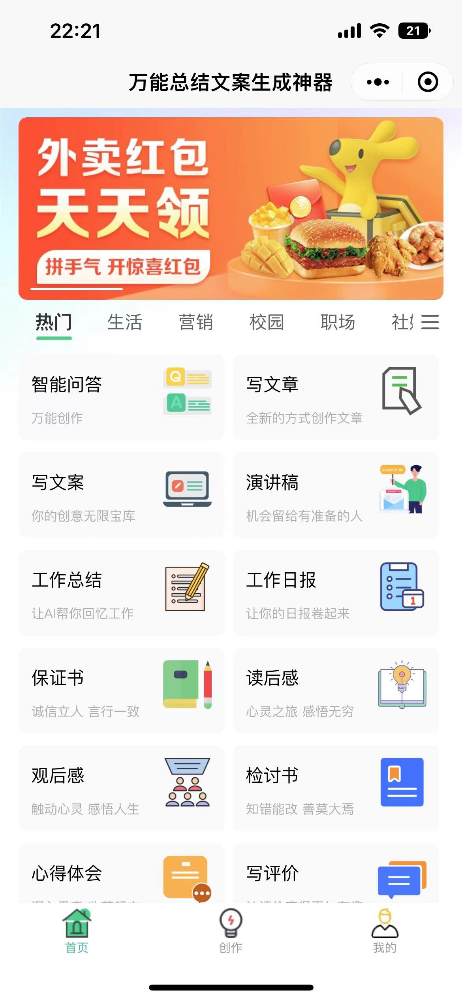
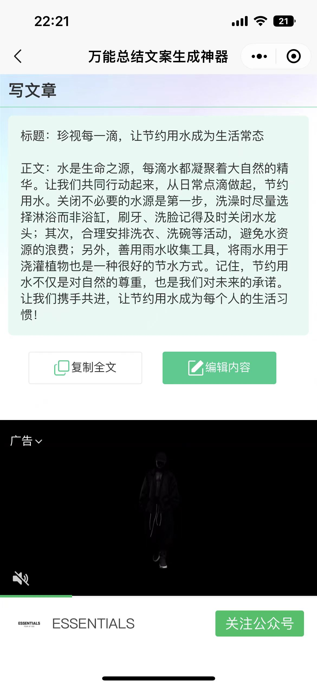
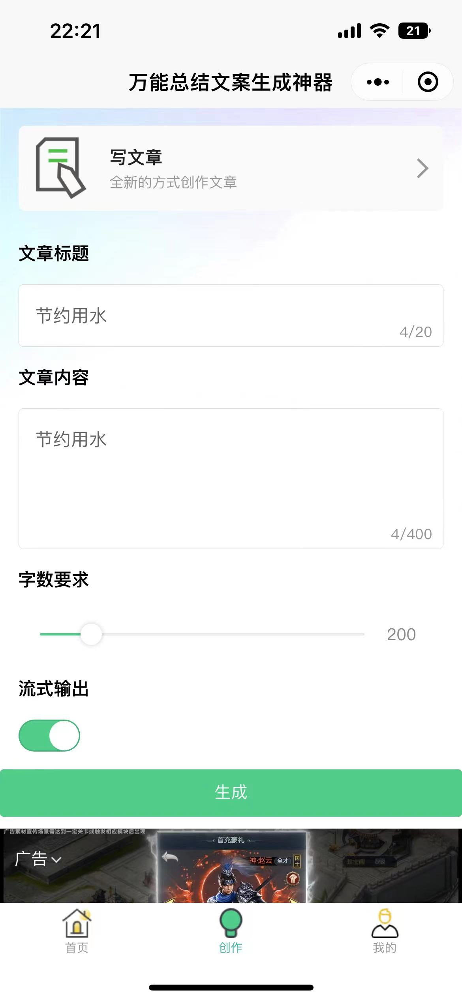
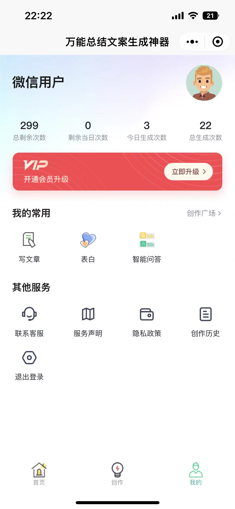

#### PC端
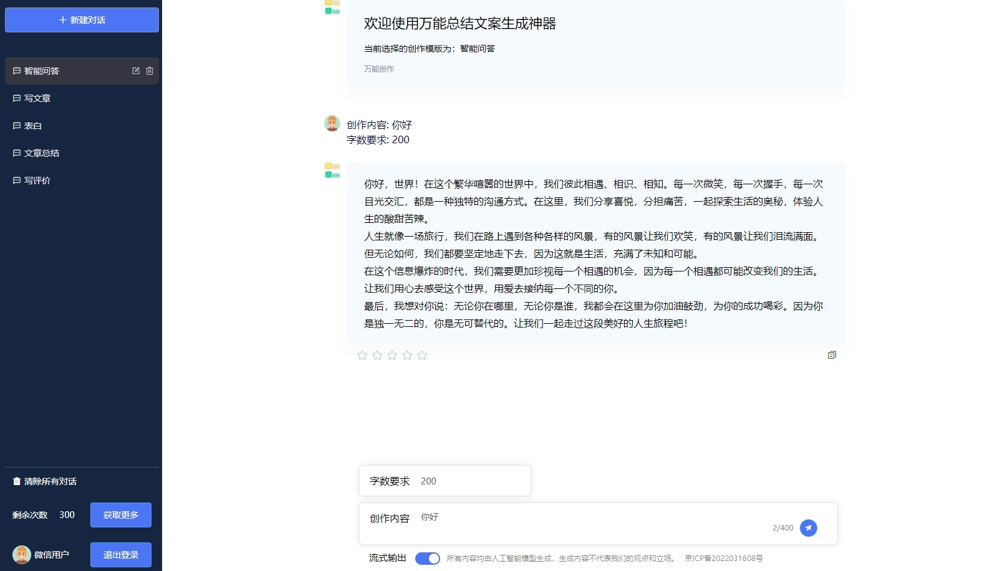
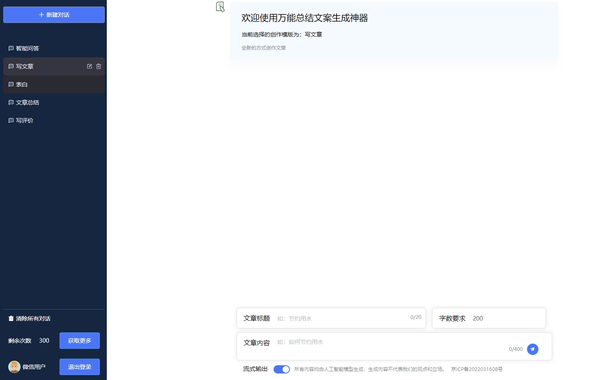
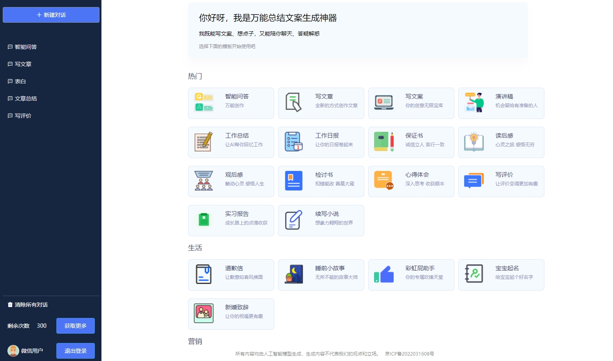

#### 后台
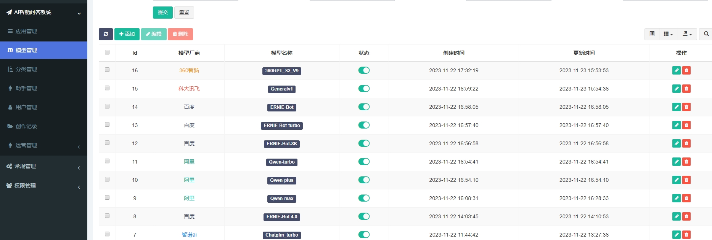
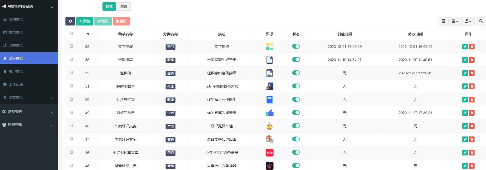
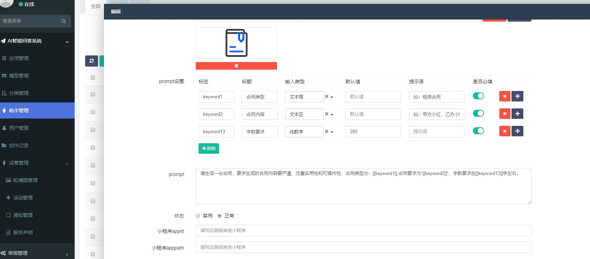
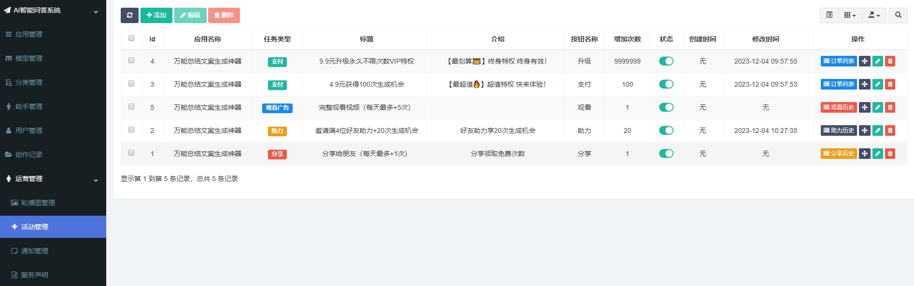
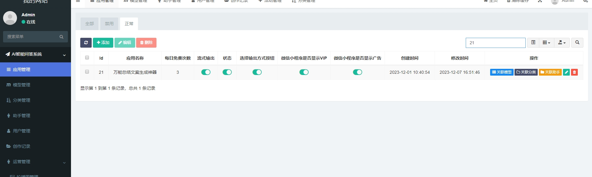
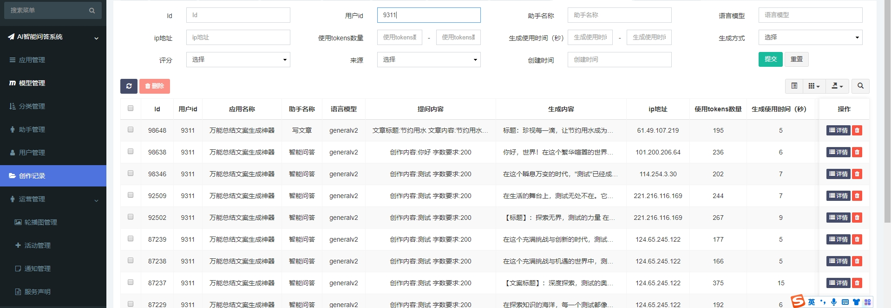

### 部署教程

#### 目录结构

chat ---- 后台及API接口

pc ---- PC端

uniapp ---- uniapp微信小程序

#### 后台及API部署
后台基于fastadmin开发，首先准备2个域名绑定到chat目录，一个做为后台的访问地址（后台域名），一个做为API接口使用（API域名）。
以宝塔部署为例：
* 首先添加站点，上传chat目录到站点，并且域名配置ssl，把chat/public做为根目录，设置伪静态为thinkphp
* 服务器上切换到chat根目录，执行命令:```composer up```
* 修改chat目录下的.env文件，填写正确的数据库、redis配置，[route]下的url填写API接口的域名(注意不要加http://或https://)
* 导入chat目录下的install.sql到数据库，访问后台域名、API域名测试即可。
* 默认后台管理员账号admin 密码123456
* 后台操作文档： [后台操作文档](image/后台操作文档.docx)


#### 流式输出部署
* 进入到chat目录执行命令：```composer require workerman/workerman```
* 进入到chat/public目录，执行命令：```php server.php start -d```
* 默认开启端口为8000,需要保证8000端口在安全组中打开
* 在小程序、pc端配置中填写wss地址即可使用 如：127.0.0.1:8000
或 在API域名的nginx配置中添加：
```
location /wss
{
proxy_pass http://127.0.0.1:8000;
proxy_http_version 1.1;
proxy_set_header Upgrade $http_upgrade;
proxy_set_header Connection "Upgrade";
proxy_set_header X-Real-IP $remote_addr;
}
```
在小程序、pc端配置中填写wss地址：wss://API域名/wss


#### PC端扫码登录部署
* 进入到chat目录执行命令：```composer require workerman/workerman```
* 进入到chat/public目录，执行命令：```php login.php start -d```
* 默认开启端口为7000,需要保证7000端口在安全组中打开
* 在PC端配置中VUE_APP_LOGIN_URL填写wss登录地址即可使用 如：127.0.0.1:7000
  或 在API域名的nginx配置中添加
```
location /wssLogin
{
proxy_pass http://127.0.0.1:7000;
proxy_http_version 1.1;
proxy_set_header Upgrade $http_upgrade;
proxy_set_header Connection "Upgrade";
proxy_set_header X-Real-IP $remote_addr;
}
```
在pc端VUE_APP_LOGIN_URL配置中填写wss登录地址：wss://API域名/wssLogin

#### 小程序部署

1. 将uniapp目录导入到HbuilderX,配置manifest.json,基础配置重新获取uniapp-id,微信小程序配置下输入小程序appid。
2. 在HbuilderX下右键点击uniapp目录，选择‘在命令行窗口打开当前目录’，下载依赖，执行命令： ```npm i```
3. 修改common/config.js配置文件
```
baseUrl: 'http://xxx.com',  //api接口请求地址（后台及API部署中的API域名）
wssUrl: 'wss://xxx.com/wss',  //#websocket地址 流式输出使用，参考流式输出部署
cdnUrl:'https://xx.com/assets/addons/robot/image', //cdn地址（这个目录下有静态图片文件/chat/public/assets/addons/robot/image，域名使用API域名即可）
appSecret: ‘xxx’, //应用appsecret 对应后台应用管理中的appsecret
appKey: ‘xxx’, //应用appkey 对应后台应用管理中的appkey
channel : 1 //应用id对应后台应用管理中的id
adVideo:'',//微信视频广告id
adReward:'',//微信激励广告id
```
4. 选择在微信小程序中运行、部署


#### PC端部署
* 下载依赖,进入pc目录，执行命令：```npm i```

* 修改配置文件,pc目录下.env
```
VUE_APP_NAME=xxx  #网站title
VUE_APP_TIMEOUT=60000  #api超时时间毫秒
VUE_APP_CHANNEL=1  #应用id 对应后台应用管理中的id
VUE_APP_KEY=xxx   #应用appkey 对应后台应用管理中的appkey
VUE_APP_SECRET=xxx  #应用appsecret 对应后台应用管理中的appsecret
VUE_APP_WEBSOCKET_URL=wss://xxx.com/wss  #websocket地址 流式输出使用，参考流式输出部署
VUE_APP_LOGIN_URL=wss://xxx.com/wssLogin  #登录地址 登录使用，参考PC端扫码登录部署
VUE_APP_CDN_URL=https://xxx.com/assets/addons/robot/image  #cdn地址（这个目录下有静态图片文件/chat/public/assets/addons/robot/image，域名使用API域名即可）
```
* 本地开发

1. 修改跟目录下vue.config.js中的target为api接口请求接口地址

2. ```npm run dev```

3. 本地访问127.0.0.1:8080

* 上线打包

1. ```npm run build```

2. 准备好pc端域名，nginx创建网站目录，pc端域名nginx配置添加：
```
location /api {
add_header 'Access-Control-Allow-Origin' '*';
proxy_pass 'https://xxxxx.com/'; #替换成你的正式环境api接口请求地址（后台及API部署中的API域名）
}
```

（3）将(1)步生成的dist目录上传覆盖至pc端网站目录下

（4）访问pc端域名

#### 支付功能部署（2种方式）
1. 微信支付
* 进入到chat目录执行命令：
```
composer require wechatpay/wechatpay-guzzle-middleware
composer require wechatpay/wechatpay
```
* 编辑chat目录下.env的配置：
```
[wechatpay]
mch_id = 微信支付商户号
serial_number = 商户API证书序列号：微信商户平台-账户中心-API安全 处获取
key_v3 = 微信支付商户API密钥V3：微信商户平台-账户中心-API安全 处获取
notify_url = https://你的API域名.com/callback/buySuccess
apiclient_key = application/api/library/robot/certs/apiclient_key.pem 微信商户平台-账户中心-API安全下载后上传到服务器chat目录下此目录
apiclient_cert = application/api/library/robot/certs/apiclient_cert.pem 微信商户平台-账户中心-API安全下载后上传到服务器chat目录下此目录
download_key = application/api/library/robot/certs/download.pem 下载证书

```


下载证书生成方式：先上传apiclient_key.pem到服务器，进入到chat目录执行命令：
```
composer exec CertificateDownloader.php -- -k 【你的APIv3秘钥】 -m 【你的商户号】 -f 【apiclient_key.pem路径 例如（./xx/xx/apiclient_key.pem)】 -s 【商户API证书序列号】 -o 【下载证书输出地址 例如（./application/xx/xx）】
```
将生成的证书文件更名上传到 chat/application/api/library/robot/certs/download.pem

2. YunGouOs支付 支持个人申请支付

* 申请链接 https://dwz.cn/boCSn0R5
* 编辑chat目录下.env的配置：
```
[yungouos]
mch_id = 微信支付商户号
key = 支付秘钥 YunGouOs后台微信支付-商户管理处获取
notify_url = https://你的API域名.com/callback/buySuccess
```

* uniapp/util/wxpay/config.js 配置商户号和支付秘钥（同上一步的mch_id,key）

#### chatgpt模型使用（2种方式）
openai 当前屏蔽了中国大陆、香港、澳门地区的直接访问
1. 方式一：api程序直接部署在海外服务器（缺点：导致接口访问缓慢，小程序卡顿）
2. 方式二：使用nginx反向代理
*  购买一台海外服务器（openai接口没有限制的地区），可以是最初级的配置，并安装宝塔+nginx
* 准备一个反向代理域名绑定到这个海外服务器，使用宝塔建立一个纯静态网站，例如：openai.xxx.com
  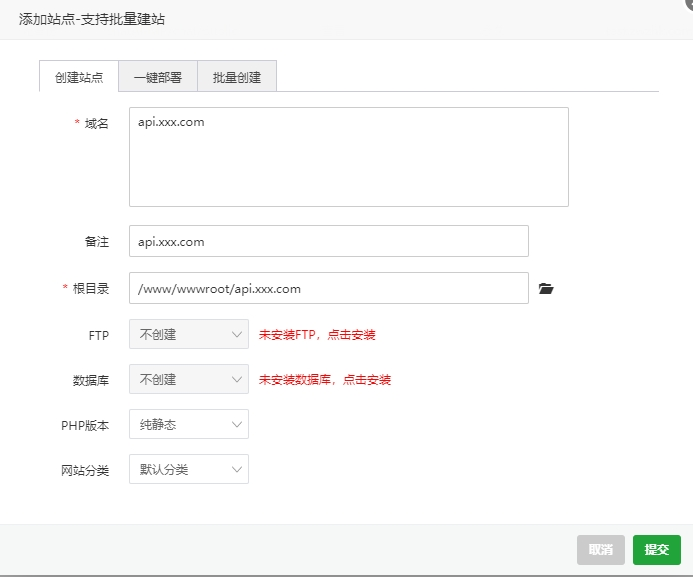
* 新增站点后点击这个站点，配置ssl，使反向代理域名可以使用https访问，开启强制HTTPS
* 点击站点配置中的反向代理，添加openai的接口地址为目标URL
  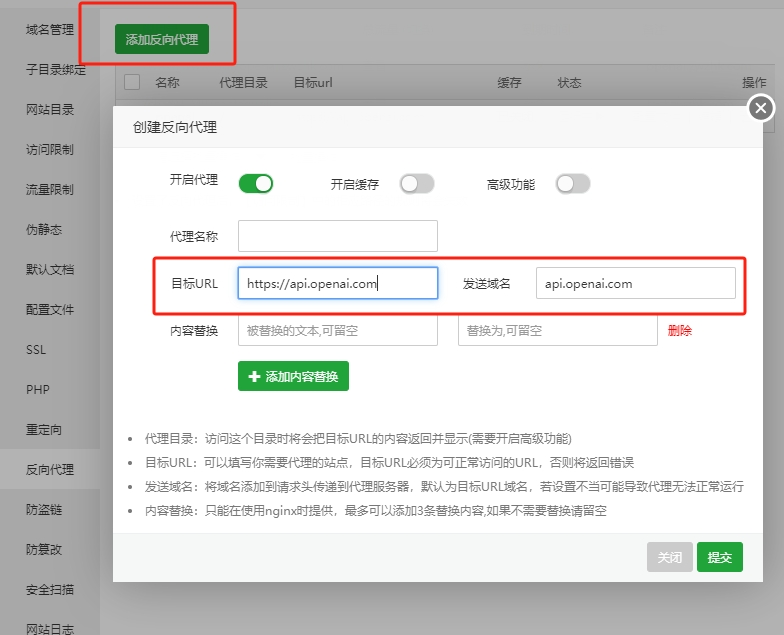
* 修改反向代理配置文件，添加： proxy_ssl_server_name on;
  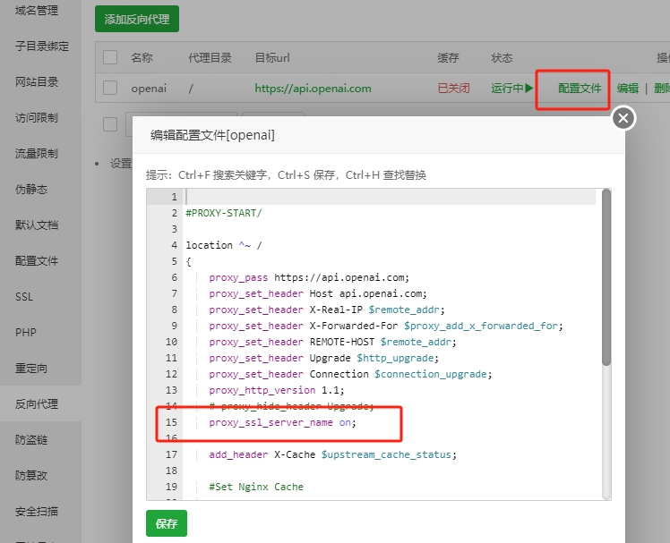
* 反向代理已配置完成，后台使用openai时，把openai的接口地址域名替换成反向代理域名即可
* 后台模型管理中api地址未填写时默认为https://api.openai.com/v1/chat/completions，只有部署在海外服务器才能使用。
* 后台模型管理中api地址的域名替换成反向代理域名即可满足程序不部署在海外也能使用openai接口
  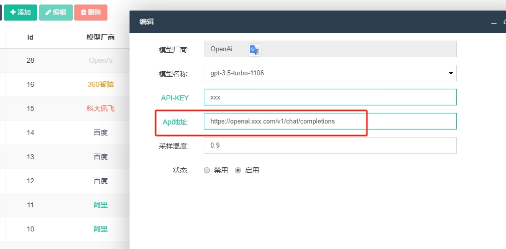
### 版权声明
1. 允许用于个人学习、毕业设计、教学案例、公益事业。
2. 开源版使用必须保留版权信息，请自觉遵守。
3. 禁止将本项目的代码和资源进行任何形式的出售，产生的一切任何后果责任由侵权者自负。
4. **开源不易，如需商业用途、去除版权，请获取升级版**。
5. **请不要私下去除官方版权，去除版权切记购买升级版。我们会认认真真去维权。去除版权前请获取升级版**
6. [点这里获取升级版](https://item.taobao.com/item.htm?spm=a21dvs.23580594.0.0.3c3a645eVrH74k&ft=t&id=754828856436)
7. 问题咨询：


